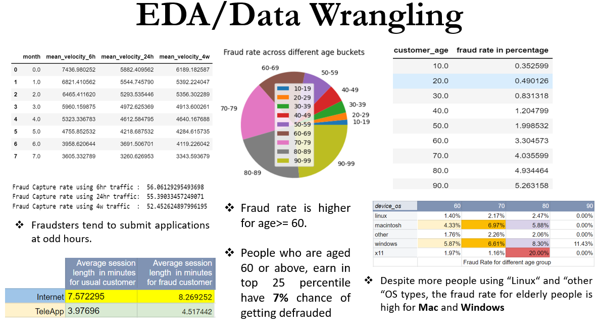

Wharton-Analytics-Fellows
============================================

In the Wharton Analytics Fellows Spring 2023 Data Challenge, I was given a task to analyze a dataset of bank account opening applications and detect fraudulent cases. By leveraging exploratory data analysis, feature engineering, and classification models, I identified key patterns and trends in customer behavior that can help banks prevent fraudulent applications. The project offers actionable insights on when additional checks should be performed to ensure the legitimacy of an applicant, as well as when to process account opening applications quickly to avoid customer inconvenience. Overall, the project's findings have practical implications for enhancing the effectiveness of fraud detection in the banking industry

## Motivation

WAF link : [https://analytics.wharton.upenn.edu/get-involved/students/student-analytics-fellows/
](https://analytics.wharton.upenn.edu/get-involved/students/student-analytics-fellows/)

As a data science enthusiast, I have always been motivated to work on challenging projects that involve leveraging data to solve real-world problems. When I learned about the Wharton Analytics Fellows program (WAF), I was immediately drawn to its reputation as a highly prestigious program that provides a unique opportunity to work on complex data challenges alongside industry experts and talented peers.

Being selected as a Wharton Analytics Fellow based on my performance in the bank fraud detection project was a huge honor for me, and it has been an incredible experience so far. I have had the opportunity to work on challenging data projects for top-tier clients, including Fox Entertainment, as a technical lead. The WAF program has given me access to cutting-edge technology, mentorship from industry leaders, and the chance to network with other talented data professionals.  

### Requirements

The model is built in an Anaconda Environment (Jupyter Notebook) and Python 3.5.0. All the libraries which need to be downloaded are mentioned in requirements.txt.

### Installation + Usage
- Install Python3 or above using Anaconda or any other method
- Install the requirements using pip install -r requirements.txt in Anaconda Prompt
- Clone this repo to your local machine
- Extract the zip file you downloaded
- Open a Python editor like Jupyter Notebook 
	* You may create and use a virtual environment to work on this project
- Run Analysis.ipynb
	

### Dataset Description

The project makes use of 2 csv files namely:

1. sp23_datachallenge.csv - Contains data on user's demographic data, banking history, application details, browser/session details.

2. Spring 2023 WAF Data Challenge Data Dictionary.csv - Contains explanation of various features provided. 
 

### Metrics
Since this is a fraud detection use case, mere R2 score and accuracy will not be perfect indicators. Hence, I have used ROC Curve and ROC-AUC score as final metric for my XGBoost Model

### Pipeline
- Baseline model evaluation (Dirty Model)
- Exploratory Data Analysis
	* Univariate Analysis & Multivariate Analysis
	* Heatmap
	* Outlier Analysis
- Feature Engineering
	* Handling abnormal negative values
	* Derived feature creation (15 extra features created)
	* Feature Encoding
	* Checking correlation & avoiding multi-collinearity
- Modeling XGBoost & Hyper parameter optimization
- Model evaluation & Feature Importance
- Model Inference & Decision Rules - **XGboost predictions for each row were provided as an input to a Decision Tree Classifier and the tree was plotted to identify buckets where "banks can immediately approve an application & avoid customer inconvenience" vs "banks need additional checks to ensure user legitimacy (Bio metric verification besides usual credit bureau background checks)"**

### EDA insights & Modeling results 

One can go through the notebook to see all the analysis or alternatively use Analysis Presentation file to see the insights I presented to the client. A snapshot of the slides are given below as well.

