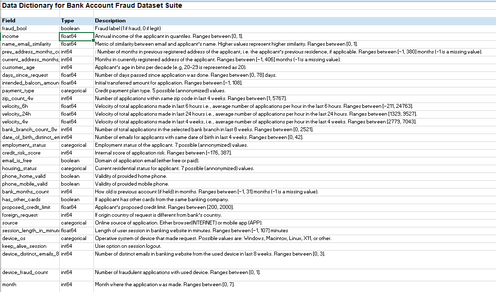

Wharton-Analytics-Fellows
============================================

In the Wharton Analytics Fellows Spring 2023 Data Challenge, I was given a task to analyze a dataset of bank account opening applications and detect fraudulent cases. By leveraging exploratory data analysis, feature engineering, and classification models, I identified key patterns and trends in customer behavior that can help banks prevent fraudulent applications. The project offers actionable insights on when additional checks should be performed to ensure the legitimacy of an applicant, as well as when to process account opening applications quickly to avoid customer inconvenience. Overall, the project's findings have practical implications for enhancing the effectiveness of fraud detection in the banking industry

### Requirements

The model is built in an Anaconda Environment (Spyder) and Python 3.5.0. All the libraries which need to be downloaded are mentioned in requirements.txt.
	

### Dataset Description

The project makes use of 4 csv files namely:

1. sp23_datachallenge.csv - Contains data on user's demographic data, banking history, application details, browser/session details.

2. Data dictionary - Contains explanation of various features provided. 

